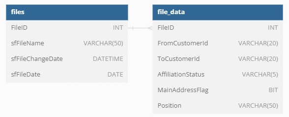

# data-loader

# Task:

Задание - написать скрипт загрузки данных и файлов вида "RU_AFFILIATION*".
Требования к реализации:
1) Создать соответствующие таблицы в БД с необходимыми полями из файлов
2) Добавить к системные поля: 
	sfFileName - Наименование файла
	sfFileChangeDate - дата изменения из метаданных файла
	sfFileDate - дата из названия файла
3) При повторной загрузке уже загруженные файлы не должны дублироваться, если они уже загружены. 
4) Сохранять состояние загрузки по дате изменения файла и при новом запуске загружать только новыйе файлы (если состояние не было изменено)
5) Загрузка должна производиться частиями (например, по 200 строк) без загрузки всего файла в память, т.к. в файлы могут быть размером десятки гигабайт.

# Prerequisites
- Python 3.9	
- SQL Server 

# Instruction

1. Create a tables which will store our data:

```sql
--MSSQL

CREATE TABLE files (
	FileID INT PRIMARY KEY IDENTITY(1,1),
	sfFileName VARCHAR(50) NOT NULL,
	sfFileChangeDate DATETIME NOT NULL,
	sfFileDate DATE NOT NULL,
	CONSTRAINT UC_FileName_FileChangeDate UNIQUE (sfFileName, sfFileChangeDate)
);
```

```sql
--MSSQL

CREATE TABLE file_data (
	FileID INT NOT NULL,
	FromCustomerId VARCHAR(20) DEFAULT '',
	ToCustomerId VARCHAR(20) DEFAULT '',
	AffiliationStatus VARCHAR(5) DEFAULT '',
	MainAddressFlag BIT DEFAULT 0,
	Position VARCHAR(50) DEFAULT '',
	CONSTRAINT FK_FileID FOREIGN KEY (FileID) REFERENCES files (FileID)
);
```

2. Clone this project

```commandline
git clone https://github.com/rickrawler/data-loader
```

3. Navigate to the project folder 

```commandline
cd path_to_your_project_folder
```

4. Create and activate venv

```commandline
python -m venv venv
venv\Scripts\activate.bat
```

5. Install required libraries

```commandline
pip install -r requirements.txt
```

6. Modify config.ini with your connection string and name of the directory with files to process


7. Run main.py

# Description

This program checks all the files in the directory you've provided. 
To be processed file should contain a date in the **"%d.%m.%Y"** format in its name and have a unique filename-latest modification date pair (or just not be processed before). 

From the scratch we have only two empty tables:


For each file its information will be logged to the **files** table and then its data will be logged to the **file_data** table (by 200 items bunches) 
